# Cupboard

> Full-stack B2B supplier portal built with Java Spring Boot, 
> Next.js, PostgreSQL, and Stripe. Features role-based access 
> control, order-to-invoice workflows, and AI-powered inventory 
> insights.
>
> Demo: https://cupboard-pearl.vercel.app/
>
> Demo login credentials: [Ref here](https://github.com/akekona/cupboard#demo-credentials)

---

## Contents
- [Overview](#overview)
- [Tech Stack](#tech-stack)
- [Architecture](#architecture)
- [Features](#features)
- [Getting Started](#getting-started)
- [Environment Variables](#environment-variables)
- [Database Schema](#database-schema)
- [API Overview](#api-overview)
- [Testing](#testing)
- [Deployment](#deployment)
- [Future Features](#future-features)

---

## Overview

Cupboard is an internal operations platform for cafe suppliers.
It manages the full supply chain from inventory and supplier 
relationships through to client orders, invoicing, and payment 
collection.

The platform supports two user roles out of the box — Admin 
and Staff — built on a flexible RBAC schema designed to support 
additional roles (driver, accounting, sales, inventory) without 
schema changes.

---

## Tech Stack

### Backend
- Java 21 + Spring Boot 4.0
- Spring Security with JWT authentication
- Spring Data JPA + Hibernate
- Flyway database migrations
- Stripe Java SDK (invoicing + webhooks)
- Maven

### Frontend
- Next.js 15 (App Router, TypeScript)
- Tailwind CSS + shadcn/ui
- Recharts (via shadcn chart)
- Lucide React icons

### Infrastructure
- PostgreSQL 16 on Neon (serverless, with connection pooling)
- Deployed on Render (backend) + Vercel (frontend)
- Stripe test mode for payment processing

---

## Architecture



**Key architectural decisions:**

- **JWT authentication** — stateless, stored in httpOnly cookie,
  validated on every request via Spring Security filter chain
- **RBAC via join table** — users can hold multiple roles 
  simultaneously (e.g. staff + accounting). Schema supports 
  future roles without migration changes
- **Monetary values stored as integers** — all prices stored 
  in smallest currency unit (cents for USD, yen for JPY) 
  following Stripe convention. Eliminates floating point 
  rounding issues
- **Multi-currency support** — Currency enum with subunit 
  divisor per currency. Frontend uses Intl.NumberFormat for 
  correct locale formatting
- **Soft deletes** — users, clients, suppliers, products use 
  deleted_at timestamp rather than hard deletes, preserving 
  historical order and invoice records
- **PostgreSQL view for client summaries** — client_summaries 
  view computes order_count, total_spend, outstanding_balance 
  on read rather than storing denormalized values, ensuring 
  accuracy without sync complexity
- **Server-side filtering and pagination** — all list endpoints 
  support page/size params with JPA Pageable. Filtering done 
  in database not application layer
- **Stripe Invoicing** — invoices sent directly from Stripe 
  to client email. Payment status updated via webhook 
  (invoice.payment_succeeded). Each Stripe invoice includes 
  itemized line items and Cupboard metadata for traceability

---

## Features

### Auth
- JWT-based login with httpOnly cookie storage
- Role-based access control (ADMIN, STAFF)
- OAuth2-ready schema (user_auth_providers table supports 
  LOCAL, GOOGLE, GITHUB per user)
- Soft-deleted users cannot authenticate
- Suspended accounts rejected at login

### Products & Inventory
- Full product catalog with 8 categories
- Stock level tracking with reorder thresholds
- Visual stock indicators (in stock / low stock / out of stock)
- Multi-supplier support per product with preferred supplier flag
- Server-side search (name or SKU), multi-select category + 
  status filtering, pagination
- Multi-SKU lookup (comma-separated paste)
- **AI restock suggestions** powered by Claude API — analyzes 
  low stock products and preferred supplier lead times

### Suppliers
- Supplier catalog with product relationships
- Cost price and lead time per product-supplier link
- Preferred supplier toggle with optimistic UI update
- Preferred supplier used as default in AI restock suggestions

### Clients
- Client account management with ACTIVE/SUSPENDED/INACTIVE status
- Client summaries via PostgreSQL view (order count, total spend,
  outstanding balance — always accurate, never stale)
- Most active clients query (last 90 days) for order creation
- Stripe Customer ID stored per client to avoid duplicate 
  customer creation

### Orders
- Full order lifecycle: DRAFT → CONFIRMED → SHIPPED → FULFILLED
- Stock validation on confirm — prevents negative inventory
- Auto-creates draft invoice on confirm
- Status tabs, client name search, order number search, 
  created-by filter
- Sort by created date or need-by date (nulls last)
- Need-by date color coding: red if past due, amber if today/tomorrow

### Invoices
- Auto-created as DRAFT when order is confirmed
- Lifecycle: DRAFT → FINALIZED → SENT → PAID → OVERDUE/REFUNDED
- Stripe Invoicing integration — sends real email with 
  hosted payment page
- Itemized line items on Stripe invoice (one per order item)
- Stripe metadata: invoice ID, order ID, client ID, 
  client name, invoice number
- Webhook handler for payment_succeeded and payment_failed events
- Admin-only refund via Stripe Refunds API

### Payments
- Payment records created by Stripe webhook on payment_succeeded
- Supports STRIPE_CARD, STRIPE_ACH, BANK_TRANSFER, CHECK, CASH
- Month/year filtering for reconciliation
- Stripe transaction IDs stored for full traceability

### Dashboard & Reports
- Admin dashboard: revenue KPIs, 6-month revenue chart, 
  activity feed
- Staff dashboard: personal order summary, low stock alerts,
  quick actions
- Reports: revenue by month (12mo), top clients by spend,
  top products by revenue, order volume over time
- All charts built with shadcn/Recharts

### Users (Admin only)
- Create staff accounts with role assignment
- Multiple roles per user (additive RBAC)
- Deactivate/reactivate accounts
- Cannot deactivate your own account

---

## Getting Started

### Prerequisites
- Java 21
- Node.js 18+
- Maven
- A Neon PostgreSQL database
- A Stripe account (test mode)

### Backend

```bash
cd server
cp src/main/resources/application.properties.example \
   src/main/resources/application.properties
# Fill in your credentials (see Environment Variables below)
./mvnw spring-boot:run
```

Server starts on http://localhost:8080

Flyway runs migrations automatically on startup:
- V1 — schema (all tables)
- V2 — views (client_summaries)
- V3 — seed data (roles, users, suppliers, products, 
  clients, orders, invoices, payments)

### Frontend

```bash
cd client
cp .env.example .env.local
# Fill in your credentials
npm install
npm run dev
```

Client starts on http://localhost:3000

### Stripe webhooks (local)

```bash
stripe listen --forward-to localhost:8080/api/webhooks/stripe
```

Copy the webhook signing secret to application.properties:
stripe.webhook-secret=whsec_...

### Demo credentials

| Role | Email | Password |
|------|-------|----------|
| Admin | ashley@cupboard.test | password123 |
| Staff | kai@cupboard.test | password123 |
| Staff + Accounting | jamie@cupboard.test | password123 |

---

## Environment Variables

### Backend (application.properties)

```properties
# Database
spring.datasource.url=jdbc:postgresql://YOUR_NEON_HOST/neondb?sslmode=require
spring.datasource.username=YOUR_USERNAME
spring.datasource.password=YOUR_PASSWORD

# Flyway (direct connection, no pooler)
spring.flyway.url=jdbc:postgresql://YOUR_NEON_HOST/neondb?sslmode=require
spring.flyway.user=YOUR_USERNAME
spring.flyway.password=YOUR_PASSWORD

# JWT
jwt.secret=YOUR_256_BIT_SECRET
jwt.expiration-ms=86400000

# Stripe
stripe.secret-key=sk_test_YOUR_KEY
stripe.webhook-secret=whsec_YOUR_SECRET

# Claude API
claude.api-key=YOUR_CLAUDE_API_KEY

# CORS
allowed.origin=http://localhost:3000
```

### Frontend (.env.local)
NEXT_PUBLIC_API_URL=http://localhost:8080
NEXT_PUBLIC_STRIPE_PUBLISHABLE_KEY=pk_test_YOUR_KEY

---

## Database Schema

### Tables
| Table | Description |
|-------|-------------|
| users | Staff accounts with soft delete |
| user_auth_providers | OAuth provider links per user |
| roles | ADMIN, STAFF, ACCOUNTING, DRIVER, SALES, INVENTORY, DEVELOPER |
| user_roles | Many-to-many user ↔ role |
| clients | Cafe accounts (ACTIVE/SUSPENDED/INACTIVE) |
| suppliers | Product suppliers with soft delete |
| products | Product catalog with stock tracking |
| product_suppliers | Many-to-many product ↔ supplier with cost price, lead time, is_preferred |
| orders | Order lifecycle with currency support |
| order_items | Line items with price snapshot at time of order |
| invoices | Invoice lifecycle with Stripe IDs |
| payments | Payment records from Stripe webhooks |

### Views
| View | Description |
|------|-------------|
| client_summaries | Computes order_count, total_spend, outstanding_balance per client on read |

### Design notes
- All monetary values stored as BIGINT (smallest currency unit)
- Currency stored as VARCHAR(3) ISO 4217 code
- Soft deletes via deleted_at TIMESTAMP on users, clients, 
  suppliers, products
- Status fields use VARCHAR with application-level enums 
  (not Postgres enums) for easier migration flexibility

---

## API Overview

### Auth
| Method | Endpoint | Description |
|--------|----------|-------------|
| POST | /api/auth/login | Returns JWT token |
| GET | /api/auth/me | Current user info |

### Products
| Method | Endpoint | Description |
|--------|----------|-------------|
| GET | /api/products | Paginated, filtered list |
| GET | /api/products/{id} | Product detail with suppliers |
| POST | /api/products | Create (admin) |
| PUT | /api/products/{id} | Update (admin, SKU + currency immutable) |
| DELETE | /api/products/{id} | Soft delete (admin) |
| GET | /api/products/low-stock | For AI restock suggestions |

### Orders
| Method | Endpoint | Description |
|--------|----------|-------------|
| GET | /api/orders | Paginated, filtered, sortable |
| GET | /api/orders/{id} | Full order with items + invoice |
| POST | /api/orders | Create draft |
| PUT | /api/orders/{id} | Update (draft only) |
| DELETE | /api/orders/{id} | Delete (draft only) |
| PATCH | /api/orders/{id}/confirm | Validates stock, decrements, creates invoice |
| PATCH | /api/orders/{id}/ship | CONFIRMED → SHIPPED |
| PATCH | /api/orders/{id}/fulfill | SHIPPED → FULFILLED |

### Invoices
| Method | Endpoint | Description |
|--------|----------|-------------|
| GET | /api/invoices | Paginated, filtered list |
| GET | /api/invoices/{id} | Invoice detail with line items |
| GET | /api/invoices/stats | KPI totals |
| PUT | /api/invoices/{id} | Update notes/due date |
| PATCH | /api/invoices/{id}/finalize | DRAFT → FINALIZED |
| PATCH | /api/invoices/{id}/send | Calls Stripe Invoicing API |
| PATCH | /api/invoices/{id}/overdue | SENT → OVERDUE |
| PATCH | /api/invoices/{id}/refund | Calls Stripe Refunds API (admin) |

### Payments
| Method | Endpoint | Description |
|--------|----------|-------------|
| GET | /api/payments | Paginated, filtered, month/year |
| GET | /api/payments/stats | KPI totals |

### Webhooks
| Method | Endpoint | Description |
|--------|----------|-------------|
| POST | /api/webhooks/stripe | Handles payment_succeeded, payment_failed |

### AI
| Method | Endpoint | Description |
|--------|----------|-------------|
| GET | /api/ai/restock-suggestions | Claude API restock analysis |

---

## Testing

```bash
cd server
./mvnw test
```

Tests use Spring Boot Test with MockMvc.
All controllers have integration tests covering:
- Happy path
- Auth guards (401 unauthenticated, 403 wrong role)
- Validation errors (400)
- Not found (404)
- Business logic errors (422)

---

## Deployment

### Backend (Render)
1. New Web Service → connect GitHub repo
2. Root directory: `server`
3. Build command: `./mvnw clean package -DskipTests`
4. Start command: `java -jar target/api-0.0.1-SNAPSHOT.jar`
5. Add all environment variables from the list above
6. Add Stripe production webhook in Stripe dashboard:
   `https://your-app.onrender.com/api/webhooks/stripe`

### Frontend (Vercel)
1. Import GitHub repo
2. Root directory: `client`
3. Add environment variables:
   - NEXT_PUBLIC_API_URL (your Render URL)
   - NEXT_PUBLIC_STRIPE_PUBLISHABLE_KEY

### Database (Neon)
- Flyway migrations run automatically on server startup
- Use direct connection URL (no pooler) for Flyway
- Use pooled connection URL for application queries

---

## Future Features

### RBAC Expansion
The role schema (roles, user_roles, user_auth_providers) is 
already designed to support these without schema changes:

- **Driver role** — mobile-friendly view to update order 
  status to Shipped/Fulfilled with delivery notes and timestamp
- **Accounting role** — read-only access to financials, 
  invoices, and reconciliation views
- **Sales role** — client management and order creation only
- **Inventory role** — products and stock management only

### Auth
- **OAuth2 social login** — user_auth_providers table already 
  supports multiple providers per user (LOCAL, GOOGLE, GITHUB).
  Spring Security OAuth2 Client dependency is the only addition needed

### Invoicing
- **Monthly consolidated invoices** — group multiple orders 
  into one invoice per client per month
- **Email invoice directly** — send invoice PDF via email 
  from the app using a transactional email provider
- **Invoice PDF generation** — downloadable PDF invoice

### Orders
- **Backorder tracking** — order_item status and 
  fulfilled_quantity fields for partial fulfillment
- **Driver delivery confirmation** — drivers mark orders 
  fulfilled with delivery notes via mobile view

### Payments
- **ACH payment support** — Stripe ACH requires additional 
  bank account verification flow
- **FX conversion** — multi-currency orders with exchange 
  rate snapshots at time of invoice

### Performance
- **Redis caching** — @Cacheable on frequently read endpoints 
  (product catalog, client summaries)
- **Database indexes** — add indexes on foreign keys and 
  commonly filtered columns as data grows

### Infrastructure  
- **CI/CD pipeline** — GitHub Actions for automated test 
  runs on pull requests
- **Environment branching** — Neon database branching for 
  staging environment matching production schema
  
